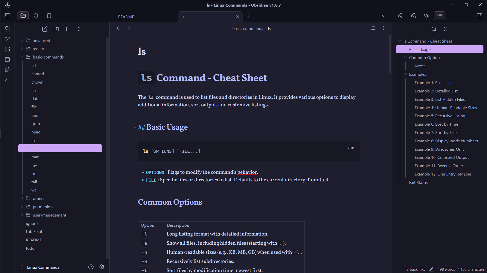

## List of Content
- [List of Content](#list-of-content)
- [Get started](#get-started)
- [System Information](#system-information)
- [File Compression and Archiving](#file-compression-and-archiving)
- [Text Processing](#text-processing)
- [Advanced Commands and Topics](#advanced-commands-and-topics)
- [User Management Commands](#user-management-commands)
- 
- [Extra Tips \& Tricks](#extra-tips--tricks)
  - [Alias Command to a one of your own](#alias-command-to-a-one-of-your-own)
- [Contribution](#contribution)
---
## Get started
1. You can read this Cheatsheet from Github directly, or a better way is to clone this repo and open it with [Obsidian](https://obsidian.md/) with these Steps.
	1.	
	```sh
	# if you have git installed on your system
	git clone https://github.com/Ahmad-Mtr/Linux-CheatSheet.git 
	```
	2. Open that directory with Obsidian
	3.  Enjoy 
	

2. Here are Alternatives to Red Hat's Lab Environment, in which you can use a bash shell to practice all Commands:
	- [Github Codespaces](https://github.com/codespaces) (You can also get pro benefits by registering in Github Education [Pack](https://github.com/education/students))
	- [Replit](https://replit.com/) ( by creating a simple C project and using the shell there)
	-  [Online Linux Terminal](https://cocalc.com/features/terminal)
	- Access a local Terminal on Windows via [WSL](https://learn.microsoft.com/en-us/windows/wsl/install)

> [!NOTE]
> You can search 'Fireship Linux' on Youtube for practical & concise 
> Content, see [this](https://youtu.be/LKCVKw9CzFo?feature=shared) for example.

And Below is a list of common Linux commands with brief descriptions and examples. For more detailed explanations and options, please follow the links to the specific `.md` files.

---
## Basic Commands

```sh
# You can use comments like other langs by using the `#`
echo "Hello World" # echo = print

mkdir test  # make directory/folder 'test'
cp src dest  # copy src to dest
rm -rf test # remove recusively & forcefully 'test' and its children

```

```sh
STR="Hello CS416 Students!" # This creates a variable named STR
echo $STR  # Hello ...
```


1. **`ls`** - List files and directories.
   ```sh
   ls  # list files and directories in the current location
   ```
   For extra details, visit [ls.md](./basic-commands/ls.md).

2. **`cd`** - Change directory.
   ```sh
   cd /path/to/directory  # change to the specified directory
   ```
   For extra details, visit [cd.md](./basic-commands/cd.md).

3. **`pwd`** - Print working directory.
   ```sh
   pwd  # display the current directory path
   ```

4. **`mkdir`** - Create a new directory.
   ```sh
   mkdir new_directory  # create a new directory named 'new_directory'
   ```

5. **`rmdir`** - Remove an empty directory.
   ```sh
   rmdir old_directory  # remove the empty directory 'old_directory'
   ```

6. **`touch`** - Create an empty file or update the timestamp of an existing file.
   ```sh
   touch newfile.txt  # create a new empty file named 'newfile.txt'
   ```

7. **`rm`** - Remove files or directories.
   ```sh
   rm file.txt  # remove the file named 'file.txt'
   ```
   For extra details, visit [rm.md](./basic-commands/rm.md).

8. **`cp`** - Copy files or directories.
   ```sh
   cp source.txt destination.txt  # copy 'source.txt' to 'destination.txt'
   ```
   For extra details, visit [cp.md](./basic-commands/cp.md).

9. **`mv`** - Move or rename files and directories.
   ```sh
   mv oldname.txt newname.txt  # rename 'oldname.txt' to 'newname.txt'
   ```
   For extra details, visit [mv.md](./basic-commands/mv.md).

10. **`cat`** - Concatenate and display file contents.
    ```sh
    cat file.txt  # display the contents of 'file.txt'
    ```

11. **`echo`** - Display a line of text.
    ```sh
    echo "Hello, World!"  # print 'Hello, World!' to the terminal
    ```

12. **`head`** - Output the first part of files.
    ```sh
    head file.txt  # display the first 10 lines of 'file.txt'
    ```
    For extra details, visit [head.md](./basic-commands/head.md).

13. **`tail`** - Output the last part of files.
    ```sh
    tail file.txt  # display the last 10 lines of 'file.txt'
    ```
    For extra details, visit [tail.md](./basic-commands/tail.md).

14. **`less`** - View file contents interactively.
    ```sh
    less file.txt  # view 'file.txt' in interactive mode
    ```

15. **`more`** - View file contents one page at a time.
    ```sh
    more file.txt  # view 'file.txt' one page at a time
    ```

16. **`find`** - Search for files in a directory hierarchy.
    ```sh
    find /path -name "filename"  # find 'filename' within '/path'
    ```
    For extra details, visit [find.md](./basic-commands/find.md).

17. **`grep`** - Search text using patterns.
    ```sh
    grep "pattern" file.txt  # search for 'pattern' in 'file.txt'
    ```
    For extra details, visit [grep.md](./basic-commands/grep.md).

18. **`chmod`** - Change file permissions.
    ```sh
    chmod 755 script.sh  # set execute permissions for 'script.sh'
    ```
    For extra details, visit [chmod.md](./basic-commands/chmod.md).

19. **`chown`** - Change file owner and group.
    ```sh
    chown user:group file.txt  # change owner and group of 'file.txt'
    ```
    For extra details, visit [chown.md](./basic-commands/chown.md).

20. **`man`** - Display the manual page for a command.
    ```sh
    man ls  # show the manual page for the 'ls' command
    ```
    For extra details, visit [man.md](./basic-commands/man.md).

21. **`wc`** - Print newline, word, and byte counts for each file.
    ```sh
    wc file.txt  # display line, word, and byte count of 'file.txt'
    ```
    For extra details, visit [wc.md](./basic-commands/wc.md).

22. **`date`** - Display or set the system date and time.
    ```sh
    date  # display the current system date and time
    ```
    For extra details, visit [date.md](./basic-commands/date.md).

23. **`file`** - Determine file type.
    ```sh
    file file.txt  # determine the type of 'file.txt'
    ```
    For extra details, visit [file.md](./basic-commands/file.md).

25. **`ln`** - Create links between files.
    ```sh
    ln source.txt link.txt  # create a hard link named 'link.txt' to 'source.txt'
    ```
    For extra details, visit [ln.md](./basic-commands/ln.md).
---

## System Info

26. **`htop`** - Interactive process viewer.
    ```sh
    htop  # interactive system monitor with more features than 'top'
    ```

27. **`ps`** - Report a snapshot of current processes.
    ```sh
    ps aux  # list all running processes with detailed information
    ```
    For extra details, visit [ps.md](./system-info/ps.md).

28. **`kill`** - Terminate processes.
    ```sh
    kill PID  # terminate the process with specified PID
    ```
    For extra details, visit [kill.md](./system-info/kill.md).

29. **`uptime`** - Show how long the system has been running.
    ```sh
    uptime  # display system uptime and load average
    ```

30. **`who` & `whoami`** - Show who is logged into the system.
    ```sh
    who  # list users currently logged in
    whoami  # list currentusrer
    ```

31. **`sort`** - Sort lines of text files.
    ```sh
    sort file.txt  # sort lines in 'file.txt'
    ```

32. **`uniq`** - Report or omit repeated lines.
    ```sh
    uniq sorted.txt  # remove duplicate lines in 'sorted.txt'
    ```


---

## User Management Commands

1. **`useradd`** - Create a new user account.
    ```sh
    useradd newuser  # create a user named 'newuser'
    ```
    For extra details, visit [useradd.md](./user-management/useradd.md).

2. **`usermod`** - Modify a user account.
    ```sh
    usermod -aG groupname username  # add 'username' to 'groupname'
    ```
    For extra details, visit [usermod.md](./user-management/usermod.md).

3. **`userdel`** - Delete a user account.
    ```sh
    userdel username  # delete the user 'username'
    ```
    For extra details, visit [userdel.md](./user-management/userdel.md).

4. **`passwd`** - Change a user password.
    ```sh
    passwd username  # change password for 'username'
    ```
    For extra details, visit [passwd.md](./user-management/passwd.md).

5. **`groupadd`** - Create a new group.
    ```sh
    groupadd groupname  # create a group named 'groupname'
    ```
    For extra details, visit [groupadd.md](./user-management/groupadd.md).

6. **`groupdel`** - Delete a group.
    ```sh
    groupdel groupname  # delete the group named 'groupname'
    ```
    For extra details, visit [groupdel.md](./user-management/groupdel.md).

7. **`groups`** - Show group memberships.
    ```sh
    groups username  # display groups 'username' belongs to
    ```

---

## Other Important Commands and Topics
0. **Linux File System** - How Directories in Linux are structured, watching this short [video](https://youtu.be/42iQKuQodW4?feature=shared) is highly recommended.
	
1. **Expansion** - Shell expansion allows you to use variables, wildcards, and other features in commands.
    ```sh
    echo {1..5}  # generates a sequence: 1 2 3 4 5
    ```
    For extra details, visit [expansion.md](./others/expansion.md).

2. **Pattern Matching** - Matching file and directory names using patterns.
    ```sh
    ls *.txt  # list all '.txt' files in the directory
    ```
    For extra details, visit [pattern-matching.md](./others/pattern-matching.md).
    
3. **Quotes in Variables**

  - Double quotes `"` allow variable resolution or referencing.

  ```sh
  name="Ahmad"
  greeting="Hello, $name!"
  echo "$greeting" # Hello, Ahmad!
  ```

  - Single quotes `'` do not allow variable resolution.

  ```sh
  name="Ahmad"
  greeting='Hello, $name!' # Notice the double quotes
  echo "$greeting" # Hello, $name!
  ```

4. **Redirect & Pipelines** - Redirect input and output, and use pipelines to connect commands.
    ```sh
    ls > files.txt  # redirect output of 'ls' to 'files.txt'
    ```
    ```sh
    cat file.txt | grep "pattern"  # use a pipeline to search 'pattern' in 'file.txt'
    ```
    For extra details, visit [redirect-pipelines.md](./others/redirect-pipelines.md).

5. **Environment Variables** - Variables that affect the way processes run on your system.
    ```sh
    echo $PATH  # display the current PATH environment variable
    ```
    For extra details, visit [environment-variables.md](./others/environment-variables.md).

6. **`history`** - Display or manipulate the command history.
    ```sh
    history  # show the command history
    ```
    For extra details, visit [history.md](./others/history.md).

---
## Extra Tips & Tricks
### Alias Command to a one of your own
- instead of creating files common way; using `touch`, you can alias it to a one of your own:
1. Open `~/.bashrc` (or `~/.bash_profile` if not there) in your editor, using vim for example.
2. add this to the User Aliases section(usually last one)
```sh
Alias batata='touch'
```
3. Source it using `source ~/.bashrc`
4. use `batata file.c` to create Files instead of `touch`

Common aliases include: `ls` to `dir`, `sudo` to `plz`
**Explanation:** Since those Commands are executable binaries, you can can create a Command that aliases/points to an existing Command (which is `touch` in this case)
## Contribution
The Cheatsheet follows a consistent Format, take the `ls` command as an example, You'll find a general use-case & explanation for the Command on this Page, but for extra details,  Options and Others, you'll find a seperate File for this Command if needed.
**Example:**
- README.md
```sh
ls # list Files & Direcctories on this place
```
For extra details visit [ls.md](./basic-commands/ls.md)

- ls.md
Options include: 
	- `-h` for more human readable style.
	-  ...etc.
You can use it to list the Root Directory in a Human-readable format:
```sh
ls -h /
```

---
## Directory Structure
using `tree` command btw.
```

```